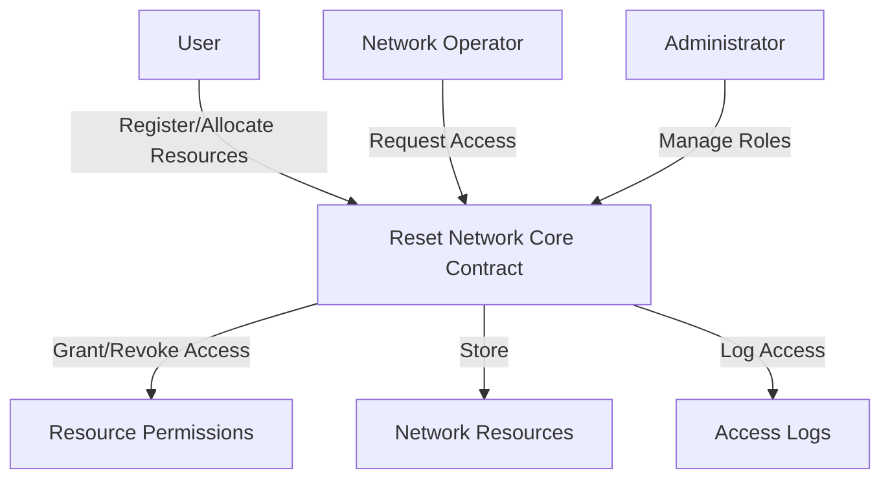

# Reset Network

A decentralized network management platform built on Stacks blockchain that enables secure, granular resource allocation and access control.

## Overview

Reset Network allows users to manage and share network resources while maintaining complete ownership and fine-grained control. The platform facilitates:

- Secure allocation of network resources and permissions
- Selective access sharing with network operators and applications
- Flexible authorization mechanisms for different roles
- Immutable audit trail of all access events
- Privacy-preserving resource management through encrypted metadata

## Architecture

The Reset Network platform is built around a core smart contract that manages resource allocation, access controls, and permissions.



### Key Components
- **Users**: Register and manage network resources and access permissions
- **Network Operators**: Can request access and manage network resources
- **Resource Permissions**: Granular access control with expiration dates
- **Access Logs**: Immutable record of all access events
- **Role-Based Access Control**: Hierarchical permission management

## Contract Documentation

### Reset Network Core Contract

The main contract (`network-core.clar`) manages all platform functionality:

#### Data Structures
- `users`: User profiles and role settings
- `network-operators`: Registered and verified network service providers
- `network-resources`: Encrypted resource metadata
- `resource-permissions`: Access control permissions
- `access-logs`: Audit trail of access events

#### Key Functions

##### User Management
```clarity
(define-public (register-user (encrypted-profile-data-url (optional (string-utf8 256))))
(define-public (update-user-profile (encrypted-profile-data-url (optional (string-utf8 256))))
```

##### Network Operator Management
```clarity
(define-public (register-operator (operator-name (string-utf8 100)) (operator-type (string-utf8 50)))
(define-public (verify-operator (operator principal))
```

##### Resource Management
```clarity
(define-public (add-network-resource (resource-type (string-utf8 50)) (encrypted-data (string-utf8 1024)) (large-data-url (optional (string-utf8 256))) (checksum (string-utf8 64)))
(define-public (update-network-resource (operator principal) (resource-type (string-utf8 50)) (encrypted-data (string-utf8 1024)) (checksum (string-utf8 64)))
```

##### Access Control
```clarity
(define-public (grant-access (accessor principal) (resource-types (list 20 (string-utf8 50))) (expires-at (optional uint)))
(define-public (revoke-access (accessor principal) (permission-id uint))
```

## Getting Started

### Prerequisites
- Clarinet
- Stacks wallet
- Node.js environment

### Installation

1. Clone the repository
2. Install dependencies with Clarinet
```bash
clarinet integrate
```

### Usage Examples

1. Register as a user:
```clarity
(contract-call? .network-core register-user (some "https://example.com/profile"))
```

2. Add network resource:
```clarity
(contract-call? .network-core add-network-resource "bandwidth" "encrypted_data_here" none "checksum_here")
```

3. Grant access to an operator:
```clarity
(contract-call? .network-core grant-access 'OPERATOR_ADDRESS (list "bandwidth" "storage") (some u100))
```

## Security Considerations

1. Data Encryption
    - All resource data must be encrypted before storage
    - Only encrypted resource metadata URLs should be stored on-chain

2. Access Control
    - Regular audit of access permissions
    - Immediate revocation of compromised access
    - Time-limited and granular access grants

3. Operator Verification
    - Network operators must be verified before accessing resources
    - Regular review of operator credentials and roles

4. Audit Logging
    - Comprehensive logging of all access attempts
    - Immutable and transparent access records

## Development

### Testing

Run the test suite:
```bash
clarinet test
```

### Local Development

1. Start local Clarinet console:
```bash
clarinet console
```

2. Deploy contracts:
```bash
clarinet deploy
```

### Key Considerations

- Always verify transaction signatures
- Implement proper error handling
- Monitor gas costs for large operations
- Regular security audits
- Keep resource metadata backups off-chain